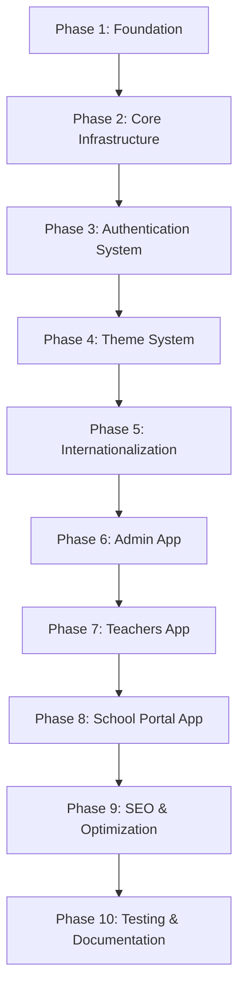

# Next.js School Management Frontend - Implementation Phases

This document breaks down the implementation into manageable phases for easier development and reference.

## Phase Overview



---

## Phase 1: Foundation Setup

**Goal**: Set up the monorepo structure, tooling, and basic configuration.

**Duration**: 1-2 days

**Dependencies**: None

### Tasks

1. **Initialize Monorepo Structure**
   - Create `frontend/` directory
   - Initialize Bun workspace (`package.json` with workspaces)
   - Create `bunfig.toml` configuration
   - Set up root `tsconfig.json`

2. **Create Package Structure**
   - Create `apps/` directory (admin, teachers, school)
   - Create `packages/` directory (shared, ui, theme, i18n)
   - Initialize each package with `package.json`

3. **Install Core Dependencies**
   - Next.js 14+ (App Router)
   - React 18+
   - TypeScript (strict mode)
   - Tailwind CSS
   - ESLint & Prettier

4. **Configure Development Tools**
   - ESLint configuration
   - Prettier configuration
   - Git hooks (optional: Husky)
   - VS Code settings (optional)

5. **Set Up Environment Configuration**
   - Create `.env.example`
   - Document required environment variables
   - Set up environment variable validation

### Deliverables

- [ ] Monorepo structure created
- [ ] All packages initialized
- [ ] TypeScript compiling without errors
- [ ] ESLint and Prettier configured
- [ ] Environment variables documented
- [ ] `bun install` works successfully
- [ ] Root scripts in `package.json`:
  - `bun dev` - Development mode
  - `bun build` - Build all apps
  - `bun lint` - Lint all packages
  - `bun type-check` - Type check all packages

### Files Created

```
frontend/
├── package.json
├── bunfig.toml
├── tsconfig.json
├── .eslintrc.js
├── .prettierrc
├── .env.example
├── apps/
│   ├── admin/
│   │   └── package.json
│   ├── teachers/
│   │   └── package.json
│   └── school/
│       └── package.json
└── packages/
    ├── shared/
    │   └── package.json
    ├── ui/
    │   └── package.json
    ├── theme/
    │   └── package.json
    └── i18n/
        └── package.json
```

### Verification

```bash
# Test workspace setup
bun install
bun type-check
bun lint
```

---

## Phase 2: Core Infrastructure

**Goal**: Build shared utilities, types, and API client foundation.

**Duration**: 2-3 days

**Dependencies**: Phase 1

### Tasks

1. **Shared Types Package** (`packages/shared/src/types/`)
   - User types (User, Role, Permission)
   - Auth types (Token, LoginRequest, LoginResponse)
   - API response types (ApiResponse, PaginatedResponse)
   - Common types (Status, Error types)

2. **Constants & Utilities** (`packages/shared/src/lib/utils/`)
   - App constants (roles, permissions, routes)
   - Utility functions (date formatting, string helpers)
   - Error constants

3. **Validation Schemas** (`packages/shared/src/lib/validation/`)
   - Zod schemas for API requests/responses
   - Login/Register schemas
   - Common validation schemas

4. **API Client Foundation** (`packages/shared/src/lib/api/`)
   - Base fetch wrapper
   - Error handling utilities
   - API endpoint constants
   - Response type definitions
   - (Note: Token injection will be added in Phase 3)

5. **Cookie Utilities** (`packages/shared/src/lib/auth/cookies.ts`)
   - Cookie reading helpers
   - Cookie setting helpers (for Server Actions)
   - Cookie deletion helpers
   - Cookie security configuration

### Deliverables

- [ ] All TypeScript types defined
- [ ] Validation schemas created
- [ ] API client base structure
- [ ] Cookie utilities implemented
- [ ] Constants defined
- [ ] All packages export correctly
- [ ] Type checking passes

### Files Created

```
packages/shared/src/
├── types/
│   ├── index.ts
│   ├── auth.ts
│   ├── user.ts
│   └── permissions.ts
├── lib/
│   ├── api/
│   │   ├── client.ts (base)
│   │   ├── endpoints.ts
│   │   └── types.ts
│   ├── auth/
│   │   └── cookies.ts
│   ├── validation/
│   │   └── schemas.ts
│   └── utils/
│       └── constants.ts
└── index.ts
```

### Verification

```bash
# Test type exports
bun run --cwd packages/shared type-check
# Test imports from other packages
```

---

## Phase 3: Authentication System

**Goal**: Implement JWT authentication, middleware, and authorization guards.

**Duration**: 3-4 days

**Dependencies**: Phase 2

### Tasks

1. **JWT Verification** (`packages/shared/src/lib/auth/jwt.ts`)
   - Install `jose` library
   - JWT verification function
   - Token payload extraction
   - Expiration checking
   - Error handling

2. **Permission System** (`packages/shared/src/lib/auth/permissions.ts`)
   - Role checking utilities
   - Permission checking utilities
   - Permission guard function
   - Role-based access control helpers

3. **API Client Enhancement** (`packages/shared/src/lib/api/client.ts`)
   - Automatic token injection from cookies
   - Token refresh on 401 errors
   - Request/response interceptors
   - Error handling with proper types

4. **Server Actions** (`packages/shared/src/lib/auth/actions.ts`)
   - Login action (calls API, sets cookies, returns user roles)
   - Logout action (clears cookies, redirects to /login)
   - Refresh token action
   - Get current user action
   - Get available apps action (based on user roles)

5. **Middleware Base** (`packages/shared/src/lib/auth/middleware.ts`)
   - Reusable middleware utilities
   - Route protection helpers
   - Token validation in middleware
   - Role-based route guards
   - Redirect to `/login` with returnUrl for unauthenticated users

6. **Centralized Auth App** (`apps/auth/`)
   - Create auth app structure
   - Login page (`app/login/page.tsx`)
   - Login form component
   - Role selector modal component
   - Role-to-app mapping logic
   - Auto-redirect for single role users
   - Modal dialog for multi-role users

### Deliverables

- [ ] JWT verification working
- [ ] Permission checking implemented
- [ ] API client with token injection
- [ ] Server Actions for auth
- [ ] Middleware utilities
- [ ] All auth flows tested manually
- [ ] Error handling comprehensive

### Files Created

```
packages/shared/src/lib/
├── auth/
│   ├── jwt.ts
│   ├── cookies.ts (enhanced)
│   ├── permissions.ts
│   ├── actions.ts
│   └── middleware.ts
└── api/
    └── client.ts (enhanced with auth)

apps/auth/
├── app/
│   ├── login/
│   │   └── page.tsx
│   ├── select-role/
│   │   └── page.tsx (fallback)
│   └── layout.tsx
├── components/
│   ├── login/
│   │   └── login-form.tsx
│   └── role-selector/
│       └── role-selector-modal.tsx
├── proxy.ts
├── package.json
├── next.config.ts
└── tailwind.config.ts
```

### Test Scenarios

- [ ] Login flow (success)
- [ ] Login flow (invalid credentials)
- [ ] Token refresh flow
- [ ] Protected route access (with valid token)
- [ ] Protected route access (with invalid token)
- [ ] Protected route access (with expired token)
- [ ] Role-based access control
- [ ] Permission-based access control
- [ ] Logout flow
- [ ] Single role user auto-redirects to correct app
- [ ] Multi-role user sees role selector modal
- [ ] Role selector modal redirects to selected app
- [ ] returnUrl query param preserved and used after login
- [ ] Direct app access redirects to /login when unauthenticated

---

## Phase 4: Theme System

**Goal**: Implement dynamic theming with CSS variables and per-school customization.

**Duration**: 2-3 days

**Dependencies**: Phase 2

### Tasks

1. **Theme Types** (`packages/theme/src/config/theme.ts`)
   - Theme configuration types
   - Color scheme types
   - Font configuration types
   - Theme mode types (light/dark)

2. **CSS Variables System** (`packages/theme/src/utils/css-variables.ts`)
   - CSS variable generation
   - Theme application utilities
   - Color transformation helpers

3. **Theme Provider** (`packages/theme/src/providers/theme-provider.tsx`)
   - Server-side theme loading
   - Client-side theme context
   - Theme switching logic
   - Theme persistence

4. **Theme Hook** (`packages/theme/src/hooks/use-theme.ts`)
   - `useTheme()` hook
   - Theme getter/setter
   - Theme mode toggle

5. **Tailwind Integration** (`tailwind.config.ts`)
   - CSS variables in Tailwind config
   - Theme color mapping
   - Custom font configuration
   - Dark mode support

6. **Font Optimization** (in each app)
   - Configure `next/font` for custom fonts
   - Font loading strategy
   - Font fallbacks

### Deliverables

- [ ] Theme types defined
- [ ] CSS variables system working
- [ ] Theme provider implemented
- [ ] Theme hook available
- [ ] Tailwind integrated with CSS variables
- [ ] Font optimization configured
- [ ] Theme switching works (client-side)
- [ ] Server-side theme loading works

### Files Created

```
packages/theme/src/
├── config/
│   └── theme.ts
├── utils/
│   └── css-variables.ts
├── providers/
│   └── theme-provider.tsx
├── hooks/
│   └── use-theme.ts
└── index.ts
```

### Test Scenarios

- [ ] Theme loads from API (server-side)
- [ ] Theme applies via CSS variables
- [ ] Theme switching works (light/dark)
- [ ] Custom colors apply correctly
- [ ] Custom fonts load properly
- [ ] Theme persists across page reloads

---

## Phase 5: Internationalization (i18n)

**Goal**: Set up multi-language support with next-intl.

**Duration**: 2-3 days

**Dependencies**: Phase 2

### Tasks

1. **Locale Configuration** (`packages/i18n/src/config/locales.ts`)
   - Supported locales definition
   - Default locale configuration
   - Locale detection logic

2. **Translation Files Structure**
   - Create `messages/en/` directory
   - Create `messages/km/` directory
   - Feature-based translation files:
     - `common.json`
     - `auth.json`
     - `admin.json`
     - `teachers.json`
     - `school.json`

3. **Translation Utilities** (`packages/i18n/src/utils/translations.ts`)
   - Translation loading helpers
   - Translation key validation
   - Translation type safety

4. **Next.js i18n Integration**
   - Configure `next-intl` in each app
   - Set up routing with locale prefixes
   - Configure middleware for locale detection
   - Set up metadata localization

5. **Language Switcher Component** (`packages/ui/src/components/language-switcher/`)
   - Language switcher UI component
   - Locale switching logic
   - URL-based locale switching

### Deliverables

- [ ] Locale configuration complete
- [ ] Translation files structure created
- [ ] Basic translations added (en, km)
- [ ] next-intl configured in all apps
- [ ] Locale routing working (`/en/...`, `/km/...`)
- [ ] Language switcher component
- [ ] Metadata localization working
- [ ] Type-safe translations

### Files Created

```
packages/i18n/src/
├── config/
│   └── locales.ts
├── messages/
│   ├── en/
│   │   ├── common.json
│   │   ├── auth.json
│   │   ├── admin.json
│   │   ├── teachers.json
│   │   └── school.json
│   └── km/
│       └── (same structure)
└── utils/
    └── translations.ts
```

### Test Scenarios

- [ ] Default locale loads correctly
- [ ] Locale switching works
- [ ] URL locale prefix works (`/en/...`, `/km/...`)
- [ ] Translations display correctly
- [ ] Missing translations handled gracefully
- [ ] Metadata localized per route

---

## Phase 6: Admin App (Backoffice)

**Goal**: Build the Super Admin backoffice application.

**Duration**: 4-5 days

**Dependencies**: Phases 3, 4, 5

### Tasks

1. **App Setup**
   - Initialize Next.js app in `apps/admin/`
   - Configure routing (`/admin/*`)
   - Set up app layout
   - Configure middleware for admin routes

2. **Authentication Pages**
   - Login page (`/admin/login`)
   - Login form with validation
   - Error handling
   - Redirect logic

3. **Dashboard Layout**
   - Admin dashboard layout
   - Navigation sidebar
   - Header with user info
   - Logout functionality

4. **User Management**
   - User list page (`/admin/users`)
   - User creation form
   - User edit form
   - User detail page
   - User status management

5. **Role & Permission Management**
   - Role list page (`/admin/roles`)
   - Role creation/editing
   - Permission assignment
   - Permission management page

6. **System Settings**
   - Settings page (`/admin/settings`)
   - System configuration
   - Feature toggles

7. **Theme & Branding Management**
   - Theme management page (`/admin/themes`)
   - Color picker interface
   - Font selection
   - Theme preview
   - Theme application per school

### Deliverables

- [ ] Admin app structure complete
- [ ] Login page functional
- [ ] Dashboard layout with navigation
- [ ] User management CRUD
- [ ] Role management CRUD
- [ ] Permission management
- [ ] System settings page
- [ ] Theme management interface
- [ ] All routes protected by middleware
- [ ] Role-based access control working

### Files Created

```
apps/admin/
├── app/
│   ├── (auth)/
│   │   └── login/
│   │       └── page.tsx
│   ├── (dashboard)/
│   │   ├── layout.tsx
│   │   ├── page.tsx (dashboard)
│   │   ├── users/
│   │   │   ├── page.tsx
│   │   │   ├── [id]/
│   │   │   │   └── page.tsx
│   │   │   └── new/
│   │   │       └── page.tsx
│   │   ├── roles/
│   │   │   └── page.tsx
│   │   ├── permissions/
│   │   │   └── page.tsx
│   │   ├── settings/
│   │   │   └── page.tsx
│   │   └── themes/
│   │       └── page.tsx
│   └── layout.tsx
├── components/
│   ├── dashboard/
│   │   ├── sidebar.tsx
│   │   └── header.tsx
│   └── users/
│       └── user-form.tsx
└── middleware.ts
```

### Test Scenarios

- [ ] Admin login works
- [ ] Dashboard loads for SUPER_ADMIN role
- [ ] User management CRUD operations
- [ ] Role management CRUD operations
- [ ] Permission assignment works
- [ ] Theme management interface functional
- [ ] Non-admin users redirected
- [ ] Expired tokens handled

---

## Phase 7: Teachers App (Frontoffice)

**Goal**: Build the Teacher frontoffice application.

**Duration**: 3-4 days

**Dependencies**: Phases 3, 4, 5

### Tasks

1. **App Setup**
   - Initialize Next.js app in `apps/teachers/`
   - Configure routing (`/teachers/*`)
   - Set up app layout
   - Configure middleware for teacher routes

2. **Authentication Pages**
   - Login page (`/teachers/login`)
   - Login form
   - Role-based redirect (primary/secondary)

3. **Dashboard Layout**
   - Teacher dashboard layout
   - Navigation for teachers
   - Role-specific navigation items

4. **Primary School Teacher Features**
   - Primary teacher dashboard (`/teachers/primary`)
   - Primary class management
   - Primary student management

5. **Secondary School Teacher Features**
   - Secondary teacher dashboard (`/teachers/secondary`)
   - Secondary class management
   - Secondary student management

6. **School Directory**
   - Public school directory (`/teachers/directory`)
   - Protected school directory (authenticated)
   - School search and filtering
   - School detail pages

### Deliverables

- [ ] Teachers app structure complete
- [ ] Login page functional
- [ ] Dashboard layout with navigation
- [ ] Primary teacher features
- [ ] Secondary teacher features
- [ ] School directory (public + protected)
- [ ] Role-based navigation (TEACHER_PRIMARY vs TEACHER_SECONDARY)
- [ ] All routes protected appropriately

### Files Created

```
apps/teachers/
├── app/
│   ├── (auth)/
│   │   └── login/
│   │       └── page.tsx
│   ├── (dashboard)/
│   │   ├── layout.tsx
│   │   ├── page.tsx
│   │   ├── primary/
│   │   │   └── page.tsx
│   │   ├── secondary/
│   │   │   └── page.tsx
│   │   └── directory/
│   │       ├── page.tsx
│   │       └── [id]/
│   │           └── page.tsx
│   └── layout.tsx
├── components/
│   └── dashboard/
│       ├── sidebar.tsx
│       └── header.tsx
└── middleware.ts
```

### Test Scenarios

- [ ] Teacher login works
- [ ] Primary teacher sees primary features only
- [ ] Secondary teacher sees secondary features only
- [ ] School directory accessible (public)
- [ ] Protected directory features work
- [ ] Role-based access control working

---

## Phase 8: School Portal App

**Goal**: Build the Parent & Student portal application.

**Duration**: 4-5 days

**Dependencies**: Phases 3, 4, 5

### Tasks

1. **App Setup**
   - Initialize Next.js app in `apps/school/`
   - Configure routing (`/school/*`)
   - Set up app layout
   - Configure middleware for school routes

2. **Authentication Pages**
   - Login page (`/school/login`)
   - Login form
   - Role-based redirect (parent/student)

3. **Dashboard Layout**
   - School portal dashboard layout
   - Navigation for parents and students
   - Role-specific navigation

4. **Parent Dashboard**
   - Parent dashboard (`/school/parent`)
   - View children list
   - View children's classes
   - View children's attendance
   - View children's grades
   - View announcements

5. **Student Dashboard**
   - Student dashboard (`/school/student`)
   - View own classes
   - View own attendance
   - View own grades
   - View announcements

6. **Feature Pages**
   - Classes page (`/school/classes`)
   - Attendance page (`/school/attendance`)
   - Grades page (`/school/grades`)
   - Announcements page (`/school/announcements`)

### Deliverables

- [ ] School portal app structure complete
- [ ] Login page functional
- [ ] Dashboard layout with navigation
- [ ] Parent dashboard with all features
- [ ] Student dashboard with all features
- [ ] Classes, attendance, grades, announcements pages
- [ ] Role-based access control (PARENT vs STUDENT)
- [ ] All routes protected appropriately

### Files Created

```
apps/school/
├── app/
│   ├── (auth)/
│   │   └── login/
│   │       └── page.tsx
│   ├── (dashboard)/
│   │   ├── layout.tsx
│   │   ├── page.tsx
│   │   ├── parent/
│   │   │   └── page.tsx
│   │   ├── student/
│   │   │   └── page.tsx
│   │   ├── classes/
│   │   │   └── page.tsx
│   │   ├── attendance/
│   │   │   └── page.tsx
│   │   ├── grades/
│   │   │   └── page.tsx
│   │   └── announcements/
│   │       └── page.tsx
│   └── layout.tsx
├── components/
│   └── dashboard/
│       ├── sidebar.tsx
│       └── header.tsx
└── middleware.ts
```

### Test Scenarios

- [ ] Parent login works
- [ ] Student login works
- [ ] Parent sees children's data
- [ ] Student sees own data only
- [ ] All feature pages load correctly
- [ ] Role-based access control working
- [ ] Data filtering by role works

---

## Phase 9: SEO & Optimization

**Goal**: Implement SEO features, metadata, and performance optimizations.

**Duration**: 2-3 days

**Dependencies**: Phases 6, 7, 8

### Tasks

1. **Metadata API Implementation**
   - Per-route metadata configuration
   - Dynamic metadata from API
   - Localized metadata
   - OpenGraph tags
   - Twitter card tags

2. **Static Generation**
   - ISR for public school directory
   - Revalidation strategy
   - Cache tags implementation

3. **Performance Optimization**
   - Image optimization
   - Font optimization (already done)
   - Code splitting verification
   - Bundle size optimization

4. **SEO Best Practices**
   - Sitemap generation
   - Robots.txt configuration
   - Structured data (JSON-LD)
   - Canonical URLs

5. **Analytics Integration** (Optional)
   - Analytics setup
   - Error tracking
   - Performance monitoring

### Deliverables

- [ ] Metadata API implemented for all routes
- [ ] Localized metadata working
- [ ] OpenGraph and Twitter cards working
- [ ] ISR configured for public pages
- [ ] Sitemap generated
- [ ] Robots.txt configured
- [ ] Performance optimizations applied
- [ ] Bundle sizes optimized

### Files Created

```
apps/*/app/
├── sitemap.ts (or sitemap.xml)
├── robots.ts (or robots.txt)
└── (metadata in each route)
```

### Test Scenarios

- [ ] Metadata displays correctly in social shares
- [ ] Localized metadata works
- [ ] Sitemap accessible
- [ ] Robots.txt configured
- [ ] Page load times optimized
- [ ] Lighthouse scores acceptable

---

## Phase 10: Testing & Documentation

**Goal**: Add comprehensive tests and documentation.

**Duration**: 3-4 days

**Dependencies**: All previous phases

### Tasks

1. **Unit Tests**
   - Test shared utilities
   - Test auth functions
   - Test API client
   - Test validation schemas

2. **Integration Tests**
   - Test API integration
   - Test authentication flows
   - Test permission checks

3. **E2E Tests** (Optional)
   - Critical user flows
   - Authentication flows
   - Role-based access

4. **Documentation**
   - API documentation
   - Component documentation
   - Setup guide
   - Deployment guide
   - Architecture documentation

5. **Code Quality**
   - Final code review
   - Refactoring if needed
   - Performance audit
   - Security audit

### Deliverables

- [ ] Unit tests written and passing
- [ ] Integration tests written and passing
- [ ] E2E tests written (if applicable)
- [ ] Documentation complete
- [ ] Code quality checks passing
- [ ] Security audit completed
- [ ] Performance benchmarks met

### Files Created

```
frontend/
├── tests/
│   ├── unit/
│   ├── integration/
│   └── e2e/
├── docs/
│   ├── API.md
│   ├── SETUP.md
│   ├── DEPLOYMENT.md
│   └── ARCHITECTURE.md
└── README.md
```

---

## Implementation Checklist

### Phase 1: Foundation
- [ ] Monorepo structure
- [ ] Package initialization
- [ ] Core dependencies
- [ ] Development tools
- [ ] Environment config

### Phase 2: Core Infrastructure
- [ ] Shared types
- [ ] Constants & utilities
- [ ] Validation schemas
- [ ] API client foundation
- [ ] Cookie utilities

### Phase 3: Authentication System
- [ ] JWT verification
- [ ] Permission system
- [ ] API client enhancement
- [ ] Server Actions
- [ ] Middleware base

### Phase 4: Theme System
- [ ] Theme types
- [ ] CSS variables
- [ ] Theme provider
- [ ] Theme hook
- [ ] Tailwind integration
- [ ] Font optimization

### Phase 5: Internationalization
- [ ] Locale configuration
- [ ] Translation files
- [ ] Translation utilities
- [ ] Next.js i18n integration
- [ ] Language switcher

### Phase 6: Admin App
- [ ] App setup
- [ ] Authentication pages
- [ ] Dashboard layout
- [ ] User management
- [ ] Role & permission management
- [ ] System settings
- [ ] Theme management

### Phase 7: Teachers App
- [ ] App setup
- [ ] Authentication pages
- [ ] Dashboard layout
- [ ] Primary teacher features
- [ ] Secondary teacher features
- [ ] School directory

### Phase 8: School Portal App
- [ ] App setup
- [ ] Authentication pages
- [ ] Dashboard layout
- [ ] Parent dashboard
- [ ] Student dashboard
- [ ] Feature pages

### Phase 9: SEO & Optimization
- [ ] Metadata API
- [ ] Static generation
- [ ] Performance optimization
- [ ] SEO best practices
- [ ] Analytics (optional)

### Phase 10: Testing & Documentation
- [ ] Unit tests
- [ ] Integration tests
- [ ] E2E tests (optional)
- [ ] Documentation
- [ ] Code quality

---

## Quick Reference

### Development Commands

```bash
# Install dependencies
bun install

# Development
bun dev                    # All apps
bun dev:admin              # Admin app only
bun dev:teachers           # Teachers app only
bun dev:school             # School portal only

# Building
bun build                  # All apps
bun build:admin            # Admin app only

# Type checking
bun type-check             # All packages

# Linting
bun lint                   # All packages

# Testing
bun test                   # All tests
bun test:unit              # Unit tests only
bun test:integration       # Integration tests only
```

### Phase Dependencies

- **Phase 1** → No dependencies
- **Phase 2** → Requires Phase 1
- **Phase 3** → Requires Phase 2
- **Phase 4** → Requires Phase 2
- **Phase 5** → Requires Phase 2
- **Phase 6** → Requires Phases 3, 4, 5
- **Phase 7** → Requires Phases 3, 4, 5
- **Phase 8** → Requires Phases 3, 4, 5
- **Phase 9** → Requires Phases 6, 7, 8
- **Phase 10** → Requires All phases

### Estimated Total Duration

- **Minimum**: 25-30 days (with focused work)
- **Realistic**: 35-45 days (with testing and refinement)
- **With Buffer**: 45-60 days (including documentation and polish)

---

## Notes

- Each phase should be completed and tested before moving to the next
- Some phases can be worked on in parallel (e.g., Phase 4 and Phase 5)
- Always run type checking and linting before considering a phase complete
- Keep the backend API Gateway URL configured correctly for each phase
- Document any deviations from the plan as you implement
