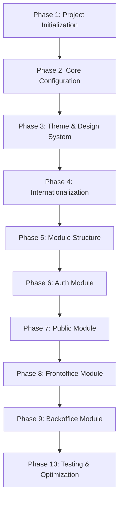

# Frontend Implementation Phases

This document breaks down the frontend implementation into manageable phases for easier development and reference.

## Phase Overview



---

## Phase 1: Project Initialization

**Goal**: Initialize Next.js 16 project with TypeScript, Bun, and base configuration.

**Duration**: 1-2 hours

**Dependencies**: None

### Tasks

1. **Initialize Next.js Project**
   - Run `bunx create-next-app@latest front --typescript --eslint --app --tailwind --no-src-dir`
   - Verify project structure is created correctly
   - Ensure `package.json` has `"packageManager": "bun@latest"` field

2. **Install Core Dependencies**
   - Install Next.js 16.1.1 and React 19.2.3
   - Install TypeScript and type definitions
   - Install Tailwind CSS 4.1.18
   - Install development dependencies

3. **Basic Project Configuration**
   - Update `tsconfig.json` with strict TypeScript settings
   - Configure ESLint for Next.js and TypeScript
   - Set up path aliases (@/components, @/lib, etc.)
   - Create `.env.example` for environment variables

### Deliverables

- [ ] Next.js project initialized in `front/` directory
- [ ] All core dependencies installed via Bun
- [ ] TypeScript compiling without errors
- [ ] ESLint configured and working
- [ ] Path aliases configured in `tsconfig.json`
- [ ] `.env.example` created with required variables
- [ ] `bun dev` runs successfully

### Files Created

```
front/
├── package.json
├── tsconfig.json
├── .eslintrc.json
├── .env.example
├── next.config.ts
├── tailwind.config.ts
├── app/
│   ├── layout.tsx
│   ├── page.tsx
│   └── globals.css
└── public/
```

### Verification

```bash
cd front
bun install
bun dev
# Verify app runs on http://localhost:3000
```

---

## Phase 2: Core Configuration

**Goal**: Configure Tailwind CSS 4.1, Material Design 3 colors, and base styling.

**Duration**: 2-3 hours

**Dependencies**: Phase 1

### Tasks

1. **Configure Tailwind CSS 4.1**
   - Update `tailwind.config.ts` with Material Design 3 color system
   - Configure CSS variables in `app/globals.css` using `@import 'tailwindcss'`
   - Set up dark mode with class strategy (`darkMode: 'class'`)
   - Configure font family for Kantumruy Pro

2. **Material Design 3 Color System**
   - Define all color tokens as CSS variables in `globals.css`
   - Create light theme color variables
   - Create dark theme color variables
   - Map colors to Tailwind theme for utility usage
   - Ensure proper contrast ratios (WCAG AA compliance)

3. **Base Styles**
   - Add Material Design 3 typography scale
   - Configure spacing system
   - Set up base component styles

### Deliverables

- [ ] Tailwind CSS 4.1 configured and working
- [ ] Material Design 3 colors defined as CSS variables
- [ ] Light and dark theme colors implemented
- [ ] Colors accessible via Tailwind utilities (bg-surface, text-primary, etc.)
- [ ] Base typography and spacing configured

### Files Modified/Created

```
front/
├── app/
│   └── globals.css              # Material 3 CSS variables & Tailwind import
├── lib/
│   └── theme/
│       └── colors.ts           # TypeScript color definitions
└── tailwind.config.ts          # Tailwind 4.1 config with Material 3 colors
```

### Color Palette

**Light Theme:**
- Surface: `#FCF9F7`
- Surface Container: `#F0EDEB`
- Surface Container High: `#EBE8E5`
- Surface Container Lowest: `#FFFFFF`
- Primary: `#036E00`
- Primary Container: `#70D65C`
- Inverse Surface: `#31302F`
- Secondary: `#5D5F5F`
- Error: `#BA1A1A`

**Dark Theme:**
- Surface: `#1C1B1A`
- Surface Container: `#252423`
- Surface Container High: `#2A2928`
- Surface Container Lowest: `#31302F`
- Primary: `#70D65C`
- Primary Container: `#036E00`
- Inverse Surface: `#FCF9F7`
- Secondary: `#A8A9A9`
- Error: `#FFB4AB`

---

## Phase 3: Theme & Design System

**Goal**: Implement theme system with light/dark mode support and Material Design 3 theming.

**Duration**: 2-3 hours

**Dependencies**: Phase 2

### Tasks

1. **Install Theme Dependencies**
   - Install `next-themes` for theme management
   - Install `lucide-react` for icons

2. **Create Theme Provider**
   - Create `components/theme/theme-provider.tsx`
   - Configure `next-themes` with SSR support
   - Set up theme switching logic
   - Handle system theme detection

3. **Integrate Theme in Layouts**
   - Add ThemeProvider to root layout
   - Configure `attribute="class"` and `enableSystem` options
   - Ensure proper SSR hydration (suppressHydrationWarning where needed)

4. **Theme Utilities**
   - Create theme toggle component
   - Add theme persistence
   - Test theme switching functionality

### Deliverables

- [ ] Theme provider component created
- [ ] Light/dark theme switching works
- [ ] System theme detection enabled
- [ ] Theme persists across page reloads
- [ ] No hydration errors in console
- [ ] Theme toggle component functional

### Files Created

```
front/
├── components/
│   ├── theme/
│   │   ├── theme-provider.tsx
│   │   └── theme-toggle.tsx
│   └── ui/
│       └── button.tsx          # Example UI component with theme
```

### Verification

- Toggle between light and dark themes
- Verify colors change correctly
- Check browser console for hydration warnings
- Test theme persistence after page reload

---

## Phase 4: Internationalization

**Goal**: Set up i18n with next-intl supporting English, Khmer, and Chinese.

**Duration**: 3-4 hours

**Dependencies**: Phase 1

### Tasks

1. **Install i18n Dependencies**
   - Install `next-intl` for App Router i18n support

2. **Configure next-intl**
   - Create `lib/i18n/config.ts` with locale configuration
   - Set up locales: en, km, zh
   - Configure default locale (en)

3. **Create Middleware**
   - Create `middleware.ts` for locale routing
   - Set up locale detection logic
   - Configure locale redirection

4. **Create Translation Files**
   - Create `lib/i18n/messages/en.json`
   - Create `lib/i18n/messages/km.json`
   - Create `lib/i18n/messages/zh.json`
   - Add initial translations for common terms

5. **Set Up Locale Routing**
   - Create `app/[locale]/` dynamic route structure
   - Update root layout to redirect to locale
   - Create locale-aware root layout

6. **Integrate Font**
   - Use `next/font/google` to load Kantumruy Pro
   - Configure font with proper subsets (latin, khmer)
   - Add font variable to Tailwind config
   - Apply font in locale layout

### Deliverables

- [ ] next-intl configured and working
- [ ] Middleware handles locale routing
- [ ] Translation files created for en, km, zh
- [ ] Locale routing works (`/en`, `/km`, `/zh`)
- [ ] Kantumruy Pro font loaded and applied
- [ ] Font supports Khmer characters

### Files Created

```
front/
├── middleware.ts
├── lib/
│   └── i18n/
│       ├── config.ts
│       └── messages/
│           ├── en.json
│           ├── km.json
│           └── zh.json
└── app/
    ├── [locale]/
    │   └── layout.tsx
    └── layout.tsx              # Root layout with locale redirect
```

### Verification

- Navigate to `/en`, `/km`, `/zh` - all should work
- Verify translations display correctly
- Check font loads and applies to all text
- Test locale switching functionality

---

## Phase 5: Module Structure

**Goal**: Create modular structure with separate layouts for auth, backoffice, frontoffice, and public modules.

**Duration**: 2-3 hours

**Dependencies**: Phase 3, Phase 4

### Tasks

1. **Create Route Groups**
   - Create `app/[locale]/(auth)/` route group
   - Create `app/[locale]/(backoffice)/` route group
   - Create `app/[locale]/(frontoffice)/` route group
   - Create `app/[locale]/(public)/` route group

2. **Create Module Layouts**
   - Create `(auth)/layout.tsx` with auth-specific structure
   - Create `(backoffice)/layout.tsx` with admin structure
   - Create `(frontoffice)/layout.tsx` with frontoffice structure
   - Create `(public)/layout.tsx` with public structure

3. **Create Module Component Directories**
   - Create `components/auth/` directory
   - Create `components/backoffice/` directory
   - Create `components/frontoffice/` directory
   - Create `components/public/` directory

4. **Create Initial Pages**
   - Create placeholder pages for each module
   - Set up basic routing structure

5. **Update Root Layout**
   - Ensure locale layout provides base structure
   - Verify all modules inherit theme and i18n

### Deliverables

- [ ] All four route groups created
- [ ] Each module has its own layout.tsx
- [ ] Module component directories created
- [ ] Initial pages created for each module
- [ ] Routing structure works correctly
- [ ] All modules inherit theme and i18n

### Files Created

```
front/
├── app/
│   └── [locale]/
│       ├── (auth)/
│       │   ├── layout.tsx
│       │   ├── login/
│       │   │   └── page.tsx
│       │   └── register/
│       │       └── page.tsx
│       ├── (backoffice)/
│       │   ├── layout.tsx
│       │   └── dashboard/
│       │       └── page.tsx
│       ├── (frontoffice)/
│       │   ├── layout.tsx
│       │   └── dashboard/
│       │       └── page.tsx
│       └── (public)/
│           ├── layout.tsx
│           └── page.tsx
└── components/
    ├── auth/
    ├── backoffice/
    ├── frontoffice/
    └── public/
```

### Verification

- Navigate to each module route
- Verify each module has its own layout
- Check that theme and i18n work in all modules
- Test routing between modules

---

## Phase 6: Auth Module

**Goal**: Implement authentication module with login, register, and auth flow.

**Duration**: 4-6 hours

**Dependencies**: Phase 5

### Tasks

1. **Auth Layout**
   - Design auth layout (centered, minimal)
   - Add auth-specific navigation (if needed)
   - Configure auth context providers

2. **Login Page**
   - Create login form component
   - Add form validation
   - Integrate with authentication API
   - Add error handling
   - Add loading states

3. **Register Page**
   - Create registration form component
   - Add form validation
   - Integrate with registration API
   - Add error handling
   - Add loading states

4. **Auth Components**
   - Create reusable form components
   - Create input components with Material 3 styling
   - Create button components
   - Add form error display components

5. **Auth Utilities**
   - Create auth helper functions
   - Set up token management
   - Configure protected route logic

### Deliverables

- [ ] Auth layout designed and implemented
- [ ] Login page functional with validation
- [ ] Register page functional with validation
- [ ] Auth components created and reusable
- [ ] Form validation working
- [ ] API integration ready
- [ ] Error handling implemented

### Files Created

```
front/
├── app/
│   └── [locale]/
│       └── (auth)/
│           ├── login/
│           │   └── page.tsx
│           └── register/
│               └── page.tsx
└── components/
    └── auth/
        ├── login-form.tsx
        ├── register-form.tsx
        ├── auth-input.tsx
        └── auth-button.tsx
```

### Verification

- Test login form validation
- Test register form validation
- Verify form submission flow
- Check error handling
- Test responsive design

---

## Phase 7: Public Module

**Goal**: Implement public-facing module with landing pages and public content.

**Duration**: 3-4 hours

**Dependencies**: Phase 5

### Tasks

1. **Public Layout**
   - Design public layout with header and footer
   - Add navigation menu
   - Configure public-specific providers

2. **Home Page**
   - Create public home page
   - Add hero section
   - Add feature sections
   - Add call-to-action sections

3. **Public Components**
   - Create header component
   - Create footer component
   - Create navigation component
   - Create hero section component

4. **Public Pages**
   - Create about page (if needed)
   - Create contact page (if needed)
   - Add other public pages as required

### Deliverables

- [ ] Public layout with header/footer
- [ ] Home page designed and implemented
- [ ] Navigation component functional
- [ ] Public components created
- [ ] Responsive design implemented
- [ ] i18n working on all public pages

### Files Created

```
front/
├── app/
│   └── [locale]/
│       └── (public)/
│           ├── page.tsx
│           ├── about/
│           │   └── page.tsx
│           └── contact/
│               └── page.tsx
└── components/
    └── public/
        ├── header.tsx
        ├── footer.tsx
        ├── navigation.tsx
        └── hero-section.tsx
```

### Verification

- Test navigation between public pages
- Verify header and footer display correctly
- Check responsive design on mobile/tablet/desktop
- Test i18n on all public pages
- Verify theme switching works

---

## Phase 8: Frontoffice Module

**Goal**: Implement frontoffice module for staff/teachers with dashboard and features.

**Duration**: 6-8 hours

**Dependencies**: Phase 5

### Tasks

1. **Frontoffice Layout**
   - Design frontoffice layout with sidebar navigation
   - Add frontoffice-specific navigation menu
   - Configure frontoffice providers

2. **Dashboard Page**
   - Create dashboard layout
   - Add statistics cards
   - Add recent activity section
   - Add quick actions

3. **Frontoffice Components**
   - Create sidebar navigation component
   - Create dashboard cards
   - Create data table components
   - Create form components

4. **Frontoffice Features**
   - Implement feature pages as needed
   - Add data fetching logic
   - Add state management

### Deliverables

- [ ] Frontoffice layout with sidebar
- [ ] Dashboard page functional
- [ ] Navigation component working
- [ ] Frontoffice components created
- [ ] Data fetching implemented
- [ ] Responsive design implemented

### Files Created

```
front/
├── app/
│   └── [locale]/
│       └── (frontoffice)/
│           ├── dashboard/
│           │   └── page.tsx
│           └── [other-features]/
└── components/
    └── frontoffice/
        ├── sidebar.tsx
        ├── dashboard-card.tsx
        └── data-table.tsx
```

### Verification

- Test navigation in frontoffice
- Verify dashboard displays correctly
- Check data fetching and display
- Test responsive design
- Verify theme and i18n work

---

## Phase 9: Backoffice Module

**Goal**: Implement backoffice/admin module with admin dashboard and management features.

**Duration**: 6-8 hours

**Dependencies**: Phase 5

### Tasks

1. **Backoffice Layout**
   - Design admin layout with sidebar navigation
   - Add admin-specific navigation menu
   - Configure admin providers

2. **Admin Dashboard**
   - Create admin dashboard layout
   - Add admin statistics
   - Add system overview
   - Add management quick actions

3. **Backoffice Components**
   - Create admin sidebar navigation
   - Create admin dashboard components
   - Create admin table components
   - Create admin form components

4. **Admin Features**
   - Implement user management
   - Implement system settings
   - Add other admin features as needed

### Deliverables

- [ ] Backoffice layout with sidebar
- [ ] Admin dashboard functional
- [ ] Admin navigation working
- [ ] Backoffice components created
- [ ] Admin features implemented
- [ ] Responsive design implemented

### Files Created

```
front/
├── app/
│   └── [locale]/
│       └── (backoffice)/
│           ├── dashboard/
│           │   └── page.tsx
│           ├── users/
│           │   └── page.tsx
│           └── settings/
│               └── page.tsx
└── components/
    └── backoffice/
        ├── sidebar.tsx
        ├── admin-card.tsx
        └── admin-table.tsx
```

### Verification

- Test admin navigation
- Verify dashboard displays correctly
- Check admin features functionality
- Test responsive design
- Verify theme and i18n work

---

## Phase 10: Testing & Optimization

**Goal**: Test all functionality, optimize performance, and ensure production readiness.

**Duration**: 4-6 hours

**Dependencies**: All previous phases

### Tasks

1. **Testing**
   - Test all routes and navigation
   - Test theme switching in all modules
   - Test i18n in all modules
   - Test responsive design on all devices
   - Test form validations
   - Test error handling

2. **Performance Optimization**
   - Optimize images and assets
   - Check bundle size
   - Optimize font loading
   - Add loading states
   - Implement code splitting

3. **Accessibility**
   - Check contrast ratios
   - Test keyboard navigation
   - Add ARIA labels where needed
   - Test with screen readers

4. **Build Verification**
   - Run production build
   - Fix any build errors
   - Test production build locally
   - Verify all features work in production

5. **Documentation**
   - Document component usage
   - Document API integration
   - Document environment variables
   - Create README for frontend

### Deliverables

- [ ] All routes tested and working
- [ ] Theme switching works everywhere
- [ ] i18n works in all modules
- [ ] Responsive design verified
- [ ] Production build successful
- [ ] Performance optimized
- [ ] Accessibility verified
- [ ] Documentation complete

### Verification

```bash
# Run production build
bun run build

# Test production build
bun start

# Run linting
bun run lint

# Type check
bun run type-check
```

---

## Dependencies Summary

```json
{
  "next": "^16.1.1",
  "react": "^19.2.3",
  "react-dom": "^19.2.3",
  "next-themes": "^0.4.6",
  "next-intl": "^4.7.0",
  "lucide-react": "^0.562.0",
  "tailwindcss": "^4.1.18",
  "typescript": "^5.9.3",
  "@types/node": "^25.0.3",
  "@types/react": "^19.2.7",
  "@types/react-dom": "^19.2.3"
}
```

---

## Development Commands

```bash
# Install dependencies
bun install

# Start development server
bun dev

# Build for production
bun run build

# Start production server
bun start

# Run linting
bun run lint

# Type check
bun run type-check
```

---

## Notes

- Each phase should be completed and tested before moving to the next
- All modules should follow Material Design 3 guidelines
- All components should be responsive and accessible
- i18n should be implemented for all user-facing text
- Theme switching should work consistently across all modules
- Follow TypeScript best practices and avoid `any` types
- Keep components small, reusable, and well-documented
