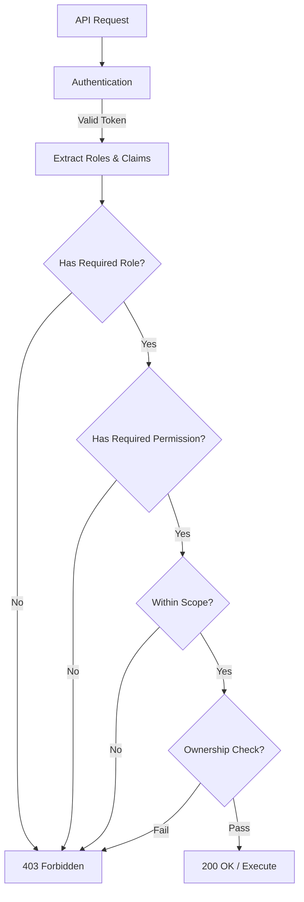

# Role Permission Matrix

This document defines the detailed permission matrix mapping each user role to allowed actions and resource access within the School Management System. This matrix is used to implement Role-Based Access Control (RBAC) across all backend APIs.

## Permission Types

- **C** = Create
- **R** = Read
- **U** = Update
- **D** = Delete
- **A** = Approve/Submit
- **E** = Export
- **–** = No access
- **\*** = Limited to specific scope (see scope notes)

---

## System Resources

1. Schools
2. Users (Admin, Director, Teacher, Parent, Student)
3. Roles & Permissions
4. Students (Academic Records)
5. Classes
6. Subjects
7. Attendance (Sessions & Records)
8. Grades / Gradebook
9. Exam Results
10. Reports & Exports
11. Audit Logs
12. System Configuration

---

## Complete Permission Matrix

### 1. Schools

| Role | Create | Read | Update | Delete | Scope |
|------|--------|------|--------|--------|-------|
| **SuperAdmin** | ✓ | ✓ | ✓ | ✓ | All schools (global) |
| **Admin** | ✗ | ✓ | ✓ | ✗ | Assigned school only |
| **Director** | ✗ | ✓ | ✗ | ✗ | Assigned school only |
| **Teacher** | ✗ | ✓ | ✗ | ✗ | Employed school only |
| **Parent** | ✗ | ✓ | ✗ | ✗ | Children's schools only |
| **Student** | ✗ | ✓ | ✗ | ✗ | Enrolled school only |

**Keycloak Permissions**: 
- SuperAdmin: `MANAGE_SCHOOLS`, `CREATE_SCHOOLS`, `DELETE_SCHOOLS`
- Admin: `UPDATE_SCHOOL`, `VIEW_SCHOOL`
- Director/Teacher/Parent/Student: `VIEW_SCHOOL`

---

### 2. Users (Admin, Director, Teacher, Parent, Student)

| Role | Create | Read | Update | Delete | Scope |
|------|--------|------|--------|--------|-------|
| **SuperAdmin** | ✓ | ✓ | ✓ | ✓ | All users (global) |
| **Admin** | ✓* | ✓ | ✓* | ✓* | School users only |
| **Director** | ✗ | ✓ | ✗ | ✗ | School users only (view) |
| **Teacher** | ✗ | ✓* | ✗ | ✗ | Students in assigned classes |
| **Parent** | ✗ | ✓* | ✗ | ✗ | Own children only |
| **Student** | ✗ | ✓* | ✓* | ✗ | Own profile only |

**Scope Notes**:
- SuperAdmin: Can create/manage all user types including Admins
- Admin: Can create Directors, Teachers, Parents, Students (not SuperAdmin or Admin)
- Teacher: Can view students in assigned classes
- Parent: Can view own children's information
- Student: Can view and update own profile (limited fields)

**Keycloak Permissions**:
- SuperAdmin: `MANAGE_ADMINISTRATORS`, `MANAGE_USERS`
- Admin: `MANAGE_USERS`, `VIEW_ALL_STUDENTS`
- Director: `VIEW_USERS`, `VIEW_ALL_STUDENTS`
- Teacher: `VIEW_ALL_STUDENTS` (filtered by class)
- Parent: `VIEW_CHILDREN`
- Student: `VIEW_OWN_PROFILE`, `UPDATE_OWN_PROFILE`

---

### 3. Roles & Permissions

| Role | Create | Read | Update | Delete | Scope |
|------|--------|------|--------|--------|-------|
| **SuperAdmin** | ✓ | ✓ | ✓ | ✓ | All roles (system-wide) |
| **Admin** | ✗ | ✓ | ✓* | ✗ | School users only |
| **Director** | ✗ | ✓ | ✗ | ✗ | School users only (view) |
| **Teacher** | ✗ | ✗ | ✗ | ✗ | None |
| **Parent** | ✗ | ✗ | ✗ | ✗ | None |
| **Student** | ✗ | ✗ | ✗ | ✗ | None |

**Scope Notes**:
- Admin: Can assign/update roles for school users (not system-level roles)

**Keycloak Permissions**:
- SuperAdmin: `MANAGE_ADMINISTRATORS`, `MANAGE_ROLES`
- Admin: `ASSIGN_ROLES` (school level)

---

### 4. Students (Academic Records)

| Role | Create | Read | Update | Delete | Scope |
|------|--------|------|--------|--------|-------|
| **SuperAdmin** | ✓ | ✓ | ✓ | ✓ | All students (global) |
| **Admin** | ✓ | ✓ | ✓ | ✓ | School students only |
| **Director** | ✗ | ✓ | ✗ | ✗ | School students only |
| **Teacher** | ✗ | ✓* | ✗ | ✗ | Assigned class students |
| **Parent** | ✗ | ✓* | ✗ | ✗ | Own children only |
| **Student** | ✗ | ✓* | ✗ | ✗ | Own data only |

**Keycloak Permissions**:
- SuperAdmin/Admin: `MANAGE_STUDENTS`
- Director/Teacher: `VIEW_ALL_STUDENTS` (filtered by school/class)
- Parent: `VIEW_CHILDREN`
- Student: `VIEW_OWN_DATA`

---

### 5. Classes

| Role | Create | Read | Update | Delete | Scope |
|------|--------|------|--------|--------|-------|
| **SuperAdmin** | ✓ | ✓ | ✓ | ✓ | All classes (global) |
| **Admin** | ✓ | ✓ | ✓ | ✓ | School classes only |
| **Director** | ✗ | ✓ | ✗ | ✗ | School classes only |
| **Teacher** | ✗ | ✓* | ✗ | ✗ | Assigned classes only |
| **Parent** | ✗ | ✓* | ✗ | ✗ | Children's classes only |
| **Student** | ✗ | ✓* | ✗ | ✗ | Enrolled classes only |

**Keycloak Permissions**:
- SuperAdmin/Admin: `MANAGE_CLASSES`
- Director/Teacher: `VIEW_CLASSES` (filtered by school/assignment)
- Parent: `VIEW_CHILDREN_CLASSES`
- Student: `VIEW_OWN_CLASSES`

---

### 6. Subjects

| Role | Create | Read | Update | Delete | Scope |
|------|--------|------|--------|--------|-------|
| **SuperAdmin** | ✓ | ✓ | ✓ | ✓ | All subjects (global) |
| **Admin** | ✓ | ✓ | ✓ | ✓ | School subjects only |
| **Director** | ✗ | ✓ | ✗ | ✗ | School subjects only |
| **Teacher** | ✗ | ✓* | ✗ | ✗ | Assigned subjects only |
| **Parent** | ✗ | ✓* | ✗ | ✗ | Children's subjects only |
| **Student** | ✗ | ✓* | ✗ | ✗ | Enrolled subjects only |

**Keycloak Permissions**:
- SuperAdmin/Admin: `MANAGE_SUBJECTS`
- Director/Teacher: `VIEW_SUBJECTS`
- Parent: `VIEW_CHILDREN_SUBJECTS`
- Student: `VIEW_OWN_SUBJECTS`

---

### 7. Attendance

| Role | Create | Read | Update | Delete | Approve | Scope |
|------|--------|------|--------|--------|---------|-------|
| **SuperAdmin** | ✓ | ✓ | ✓ | ✓ | ✓ | All attendance (global) |
| **Admin** | ✓ | ✓ | ✓ | ✓ | ✓ | School attendance only |
| **Director** | ✗ | ✓ | ✗ | ✗ | ✗ | School attendance only |
| **Teacher** | ✓* | ✓* | ✓* | ✗ | ✗ | Assigned classes only |
| **Parent** | ✗ | ✓* | ✗ | ✗ | ✗ | Children's attendance only |
| **Student** | ✗ | ✓* | ✗ | ✗ | ✗ | Own attendance only |

**Scope Notes**:
- Teacher: Create/manage attendance for assigned classes only
- Special permission for class leaders: `COLLECT_ATTENDANCE`

**Keycloak Permissions**:
- SuperAdmin/Admin: `MANAGE_ATTENDANCE`, `COLLECT_ATTENDANCE`
- Teacher: `MANAGE_ATTENDANCE`, `COLLECT_ATTENDANCE` (class leader)
- Director: `VIEW_ATTENDANCE`
- Parent: `VIEW_CHILDREN_ATTENDANCE`
- Student: `VIEW_OWN_ATTENDANCE`

---

### 8. Grades / Gradebook

| Role | Create | Read | Update | Delete | Approve | Scope |
|------|--------|------|--------|--------|---------|-------|
| **SuperAdmin** | ✓ | ✓ | ✓ | ✓ | ✓ | All grades (global) |
| **Admin** | ✓ | ✓ | ✓ | ✓ | ✓ | School grades only |
| **Director** | ✗ | ✓ | ✗ | ✗ | ✗ | School grades only |
| **Teacher** | ✓* | ✓* | ✓* | ✗ | ✗ | Assigned classes only |
| **Parent** | ✗ | ✓* | ✗ | ✗ | ✗ | Children's grades only |
| **Student** | ✗ | ✓* | ✗ | ✗ | ✗ | Own grades only |

**Scope Notes**:
- Teacher: Can record/modify grades for students in assigned classes
- Homeroom teachers (grades 1-6): `MANAGE_HOMEROOM`
- Class teachers (grades 7-12): `COLLECT_EXAM_RESULTS`

**Keycloak Permissions**:
- SuperAdmin/Admin: `MANAGE_GRADES`
- Teacher: `MANAGE_GRADES`, `MANAGE_HOMEROOM`, `COLLECT_EXAM_RESULTS`
- Director: `VIEW_GRADES`
- Parent: `VIEW_CHILDREN_GRADES`
- Student: `VIEW_OWN_GRADES`

---

### 9. Exam Results

| Role | Create | Read | Update | Delete | Submit | Scope |
|------|--------|------|--------|--------|--------|-------|
| **SuperAdmin** | ✓ | ✓ | ✓ | ✓ | ✓ | All results (global) |
| **Admin** | ✓ | ✓ | ✓ | ✓ | ✓ | School results only |
| **Director** | ✗ | ✓ | ✗ | ✗ | ✗ | School results only |
| **Teacher** | ✓* | ✓* | ✓* | ✗ | ✓* | Assigned classes only |
| **Parent** | ✗ | ✓* | ✗ | ✗ | ✗ | Children's results only |
| **Student** | ✗ | ✓* | ✗ | ✗ | ✗ | Own results only |

**Scope Notes**:
- Teacher (grades 7-12): Can collect and submit exam results for assigned classes

**Keycloak Permissions**:
- SuperAdmin/Admin: `MANAGE_EXAM_RESULTS`
- Teacher: `COLLECT_EXAM_RESULTS` (grades 7-12 only)
- Director: `VIEW_EXAM_RESULTS`
- Parent: `VIEW_CHILDREN_EXAM_RESULTS`
- Student: `VIEW_OWN_EXAM_RESULTS`

---

### 10. Reports & Exports

| Role | Generate | Read | Export | Scope |
|------|----------|------|--------|-------|
| **SuperAdmin** | ✓ | ✓ | ✓ | All reports (global) |
| **Admin** | ✓ | ✓ | ✓ | School reports only |
| **Director** | ✓ | ✓ | ✓ | School reports only |
| **Teacher** | ✓* | ✓* | ✓* | Assigned classes only |
| **Parent** | ✗ | ✓* | ✗ | Children's reports only |
| **Student** | ✗ | ✓* | ✗ | Own reports only |

**Scope Notes**:
- Teacher: Can submit reports for assigned classes

**Keycloak Permissions**:
- SuperAdmin/Admin/Director: `GENERATE_REPORTS`, `EXPORT_REPORTS`
- Teacher: `SUBMIT_REPORTS`, `VIEW_REPORTS` (assigned classes)
- Parent: `VIEW_CHILDREN_REPORTS`
- Student: `VIEW_OWN_REPORTS`

---

### 11. Audit Logs

| Role | Create | Read | Export | Scope |
|------|--------|------|--------|-------|
| **SuperAdmin** | Auto | ✓ | ✓ | All logs (global) |
| **Admin** | Auto | ✓ | ✓ | School logs only |
| **Director** | Auto | ✓ | ✗ | School logs only |
| **Teacher** | Auto | ✗ | ✗ | None |
| **Parent** | Auto | ✗ | ✗ | None |
| **Student** | Auto | ✗ | ✗ | None |

**Keycloak Permissions**:
- SuperAdmin: `MANAGE_AUDIT`, `VIEW_AUDIT`, `EXPORT_AUDIT`
- Admin/Director: `VIEW_AUDIT` (school level)

---

### 12. System Configuration

| Role | Create | Read | Update | Delete | Scope |
|------|--------|------|--------|--------|-------|
| **SuperAdmin** | ✓ | ✓ | ✓ | ✓ | System-wide |
| **Admin** | ✗ | ✓ | ✓* | ✗ | School config only |
| **Director** | ✗ | ✓ | ✗ | ✗ | School config only |
| **Teacher** | ✗ | ✗ | ✗ | ✗ | None |
| **Parent** | ✗ | ✗ | ✗ | ✗ | None |
| **Student** | ✗ | ✗ | ✗ | ✗ | None |

**Keycloak Permissions**:
- SuperAdmin: `MANAGE_SYSTEM_CONFIG`
- Admin: `MANAGE_SCHOOL_CONFIG`
- Director: `VIEW_SCHOOL_CONFIG`

---

## Detailed Permission Matrix by Role

### SuperAdmin Permissions

| Resource | Create | Read | Update | Delete | Special | Scope |
|----------|--------|------|--------|--------|---------|-------|
| Schools | ✓ | ✓ | ✓ | ✓ | – | Global |
| System Admins | ✓ | ✓ | ✓ | ✓ | – | Global |
| School Admins | ✓ | ✓ | ✓ | ✓ | – | Global |
| Directors | ✓ | ✓ | ✓ | ✓ | – | Global |
| Teachers | ✓ | ✓ | ✓ | ✓ | – | Global |
| Parents | ✓ | ✓ | ✓ | ✓ | – | Global |
| Students | ✓ | ✓ | ✓ | ✓ | – | Global |
| Classes | ✓ | ✓ | ✓ | ✓ | Assign Teachers | Global |
| Subjects | ✓ | ✓ | ✓ | ✓ | – | Global |
| Attendance | ✓ | ✓ | ✓ | ✓ | Approve | Global |
| Grades | ✓ | ✓ | ✓ | ✓ | Override | Global |
| Exam Results | ✓ | ✓ | ✓ | ✓ | Approve | Global |
| Reports | ✓ | ✓ | ✓ | ✓ | Export | Global |
| Audit Logs | – | ✓ | – | ✓ | Export | Global |
| System Config | ✓ | ✓ | ✓ | ✓ | – | Global |

**Keycloak Client Roles**:
- MANAGE_ADMINISTRATORS
- MANAGE_ATTENDANCE
- COLLECT_ATTENDANCE
- MANAGE_GRADES
- COLLECT_EXAM_RESULTS
- SUBMIT_REPORTS
- VIEW_ALL_STUDENTS
- MANAGE_HOMEROOM

---

### Admin Permissions

| Resource | Create | Read | Update | Delete | Special | Scope |
|----------|--------|------|--------|--------|---------|-------|
| Schools | ✗ | ✓ | ✓ | ✗ | – | Assigned school |
| System Admins | ✗ | ✗ | ✗ | ✗ | – | None |
| School Admins | ✗ | ✗ | ✗ | ✗ | – | None |
| Directors | ✓ | ✓ | ✓ | ✓ | – | School |
| Teachers | ✓ | ✓ | ✓ | ✓ | Assign Classes | School |
| Parents | ✓ | ✓ | ✓ | ✓ | Link Children | School |
| Students | ✓ | ✓ | ✓ | ✓ | Enroll | School |
| Classes | ✓ | ✓ | ✓ | ✓ | Assign Teachers | School |
| Subjects | ✓ | ✓ | ✓ | ✓ | – | School |
| Attendance | ✓ | ✓ | ✓ | ✓ | Approve | School |
| Grades | ✓ | ✓ | ✓ | ✓ | Override | School |
| Exam Results | ✓ | ✓ | ✓ | ✓ | Approve | School |
| Reports | ✓ | ✓ | ✓ | ✓ | Export | School |
| Audit Logs | – | ✓ | – | ✗ | Export | School |
| School Config | ✗ | ✓ | ✓ | ✗ | – | School |

**Keycloak Client Roles**:
- MANAGE_ATTENDANCE
- COLLECT_ATTENDANCE
- MANAGE_GRADES
- COLLECT_EXAM_RESULTS
- SUBMIT_REPORTS
- VIEW_ALL_STUDENTS
- MANAGE_HOMEROOM

---

### Director Permissions

| Resource | Create | Read | Update | Delete | Special | Scope |
|----------|--------|------|--------|--------|---------|-------|
| Schools | ✗ | ✓ | ✗ | ✗ | – | Assigned school |
| Users (All) | ✗ | ✓ | ✗ | ✗ | – | School (view) |
| Students | ✗ | ✓ | ✗ | ✗ | – | School |
| Classes | ✗ | ✓ | ✗ | ✗ | – | School |
| Subjects | ✗ | ✓ | ✗ | ✗ | – | School |
| Attendance | ✗ | ✓ | ✗ | ✗ | – | School |
| Grades | ✗ | ✓ | ✗ | ✗ | – | School |
| Exam Results | ✗ | ✓ | ✗ | ✗ | – | School |
| Reports | ✓ | ✓ | ✗ | ✗ | Export | School |
| Audit Logs | – | ✓ | – | ✗ | – | School |
| School Config | ✗ | ✓ | ✗ | ✗ | – | School |

**Keycloak Client Roles**:
- VIEW_SCHOOL_DASHBOARD
- VIEW_ALL_STUDENTS
- VIEW_ACADEMIC_DATA
- GENERATE_REPORTS
- EXPORT_REPORTS
- VIEW_AUDIT

---

### Teacher Permissions

| Resource | Create | Read | Update | Delete | Special | Scope |
|----------|--------|------|--------|--------|---------|-------|
| Students | ✗ | ✓ | ✗ | ✗ | – | Assigned classes |
| Classes | ✗ | ✓ | ✗ | ✗ | – | Assigned classes |
| Subjects | ✗ | ✓ | ✗ | ✗ | – | Assigned subjects |
| Attendance | ✓ | ✓ | ✓ | ✗ | Collect/Submit | Assigned classes |
| Grades | ✓ | ✓ | ✓ | ✗ | – | Assigned classes |
| Exam Results | ✓* | ✓ | ✓* | ✗ | Collect/Submit* | Assigned classes |
| Reports | ✓* | ✓ | ✗ | ✗ | Submit | Assigned classes |
| Own Profile | ✗ | ✓ | ✓ | ✗ | – | Self |

**Scope Notes**:
- Attendance: Full CRUD for assigned classes
- Grades: Full CRUD for assigned classes
- Exam Results: Class teachers (grades 7-12) can collect and submit
- Homeroom: Homeroom teachers (grades 1-6) have additional permissions

**Keycloak Client Roles**:
- MANAGE_ATTENDANCE
- MANAGE_GRADES
- COLLECT_ATTENDANCE (class leader)
- COLLECT_EXAM_RESULTS (grades 7-12)
- SUBMIT_REPORTS
- MANAGE_HOMEROOM (grades 1-6)

---

### Parent Permissions

| Resource | Create | Read | Update | Delete | Special | Scope |
|----------|--------|------|--------|--------|---------|-------|
| Students | ✗ | ✓ | ✗ | ✗ | – | Own children |
| Classes | ✗ | ✓ | ✗ | ✗ | – | Children's classes |
| Subjects | ✗ | ✓ | ✗ | ✗ | – | Children's subjects |
| Attendance | ✗ | ✓ | ✗ | ✗ | – | Children's attendance |
| Grades | ✗ | ✓ | ✗ | ✗ | – | Children's grades |
| Exam Results | ✗ | ✓ | ✗ | ✗ | – | Children's results |
| Reports | ✗ | ✓ | ✗ | ✗ | – | Children's reports |
| Own Profile | ✗ | ✓ | ✓ | ✗ | – | Self |

**Keycloak Client Roles**:
- VIEW_CHILDREN
- VIEW_CHILDREN_ATTENDANCE
- VIEW_CHILDREN_GRADES
- VIEW_CHILDREN_CLASSES
- VIEW_CHILDREN_SUBJECTS
- VIEW_CHILDREN_REPORTS

---

### Student Permissions

| Resource | Create | Read | Update | Delete | Special | Scope |
|----------|--------|------|--------|--------|---------|-------|
| Classes | ✗ | ✓ | ✗ | ✗ | – | Enrolled classes |
| Subjects | ✗ | ✓ | ✗ | ✗ | – | Enrolled subjects |
| Attendance | ✗ | ✓ | ✗ | ✗ | – | Own attendance |
| Grades | ✗ | ✓ | ✗ | ✗ | – | Own grades |
| Exam Results | ✗ | ✓ | ✗ | ✗ | – | Own results |
| Reports | ✗ | ✓ | ✗ | ✗ | – | Own reports |
| Own Profile | ✗ | ✓ | ✓* | ✗ | – | Self |

**Scope Notes**:
- Profile: Can update limited fields (e.g., contact info, photo)

**Keycloak Client Roles**:
- VIEW_OWN_DATA
- VIEW_OWN_ATTENDANCE
- VIEW_OWN_GRADES
- VIEW_OWN_CLASSES
- VIEW_OWN_SUBJECTS
- VIEW_OWN_EXAM_RESULTS
- UPDATE_OWN_PROFILE

---

## Ownership Rules

### Own Data vs All Data

| Role | Own Data Access | All Data Access | Scope Filter |
|------|-----------------|-----------------|--------------|
| **SuperAdmin** | ✓ | ✓ | None (global) |
| **Admin** | ✓ | ✓ | `WHERE school_id = :schoolId` |
| **Director** | ✓ | ✓ (read) | `WHERE school_id = :schoolId` |
| **Teacher** | ✓ | ✗ | `WHERE class_id IN (:assignedClassIds)` |
| **Parent** | ✓ | ✗ | `WHERE student_id IN (:childrenIds)` |
| **Student** | ✓ | ✗ | `WHERE student_id = :studentId` |

---

## Access Scope Hierarchy

```
Global (SuperAdmin)
  └── School-Level (Admin, Director)
      └── Class-Level (Teacher)
          └── User-Level (Parent, Student)
```

### Scope Boundaries

1. **Global Scope** (SuperAdmin)
   - Access: All schools, all data
   - Filter: None
   - Context: System-wide

2. **School Scope** (Admin, Director)
   - Access: Single school
   - Filter: `school_id = :assignedSchoolId`
   - Context: School-specific

3. **Class Scope** (Teacher)
   - Access: Assigned classes within school
   - Filter: `class_id IN (:assignedClassIds) AND school_id = :schoolId`
   - Context: Class-specific within school

4. **Child Scope** (Parent)
   - Access: Linked children (can span multiple schools)
   - Filter: `student_id IN (:childrenIds)`
   - Context: Child-specific (multi-school)

5. **Self Scope** (Student)
   - Access: Own data only
   - Filter: `student_id = :currentStudentId`
   - Context: Self-only

---

## JWT Claims Structure

JWT tokens will include role and scope information:

```json
{
  "sub": "user-uuid",
  "email": "user@example.com",
  "realm_roles": ["TEACHER", "PARENT"],
  "client_roles": {
    "school-management-client": [
      "MANAGE_ATTENDANCE",
      "MANAGE_GRADES",
      "VIEW_CHILDREN"
    ]
  },
  "school_id": "school-uuid",
  "teacher_assignments": ["class-1-uuid", "class-2-uuid"],
  "children_ids": ["child-1-uuid", "child-2-uuid"],
  "active_role": "TEACHER"
}
```

---

## API Authorization Patterns

### Spring Security @PreAuthorize Examples

```kotlin
// SuperAdmin only
@PreAuthorize("hasRole('SUPER_ADMIN')")
fun createSchool(...)

// Admin or SuperAdmin
@PreAuthorize("hasRole('SUPER_ADMIN') or hasRole('ADMINISTRATOR')")
fun manageSchoolUsers(...)

// Teacher with specific permission
@PreAuthorize("hasRole('TEACHER') and hasAuthority('MANAGE_ATTENDANCE')")
fun markAttendance(...)

// Teacher accessing assigned class
@PreAuthorize("hasRole('TEACHER') and @securityService.hasAccessToClass(#classId)")
fun updateGrades(@PathVariable classId: UUID, ...)

// Parent accessing own child
@PreAuthorize("hasRole('PARENT') and @securityService.isChildOf(#studentId)")
fun viewChildGrades(@PathVariable studentId: UUID, ...)

// Student accessing own data
@PreAuthorize("hasRole('STUDENT') and #studentId == authentication.principal.studentId")
fun viewOwnGrades(@PathVariable studentId: UUID, ...)
```

---

## Row-Level Security Filters

### Database Query Filters by Role

```kotlin
// SuperAdmin - No filter
fun findAll(): List<Entity>

// Admin - School filter
fun findAll(schoolId: UUID): List<Entity> {
    // WHERE school_id = :schoolId
}

// Director - School filter (read-only)
fun findAllBySchool(schoolId: UUID): List<Entity> {
    // WHERE school_id = :schoolId
}

// Teacher - Class filter
fun findAllByTeacherClasses(teacherId: UUID, schoolId: UUID): List<Entity> {
    // WHERE class_id IN (SELECT class_id FROM teacher_assignments WHERE teacher_id = :teacherId)
    //   AND school_id = :schoolId
}

// Parent - Children filter
fun findAllByChildren(parentId: UUID): List<Entity> {
    // WHERE student_id IN (SELECT child_id FROM parent_children WHERE parent_id = :parentId)
}

// Student - Self filter
fun findByStudent(studentId: UUID): Entity {
    // WHERE student_id = :studentId
}
```

---

## Multi-Role Scenarios

### User with Multiple Roles

When a user has multiple roles (e.g., Teacher + Parent):

1. **Role Selection**: User selects active role at login or switches context
2. **Permission Union**: User has permissions from all assigned roles
3. **Scope Intersection**: Most restrictive scope applies per resource
4. **Context Switching**: User can switch between role contexts

Example:
- User is both Teacher and Parent
- As Teacher: Access assigned classes
- As Parent: Access own children
- Cannot mix contexts: Teacher permissions don't grant access to own children's data

---

## Permission Validation Flow



---

## Implementation Checklist

### Backend Implementation

- [ ] Define Keycloak realm roles (SUPER_ADMIN, ADMINISTRATOR, DIRECTOR, TEACHER, PARENT, STUDENT)
- [ ] Define Keycloak client roles (permissions)
- [ ] Configure composite role mappings
- [ ] Implement Spring Security configuration
- [ ] Implement `@PreAuthorize` annotations on all endpoints
- [ ] Implement row-level security filters
- [ ] Implement multi-tenancy filters (school context)
- [ ] Implement custom security service for complex checks
- [ ] Implement JWT claim extraction and validation
- [ ] Add audit logging for all role-based actions

### Database Implementation

- [ ] Add `school_id` column to all relevant tables
- [ ] Add indexes on `school_id` for performance
- [ ] Create `teacher_assignments` table (teacher-to-class mapping)
- [ ] Create `parent_children` table (parent-to-student mapping)
- [ ] Create database views for role-based queries
- [ ] Implement database-level row security policies (if using PostgreSQL RLS)

### Testing

- [ ] Unit tests for permission checks
- [ ] Integration tests for role-based API access
- [ ] Test multi-role scenarios
- [ ] Test scope boundary enforcement
- [ ] Test ownership validation
- [ ] Security penetration testing

---

## Approval

- [ ] Role definitions reviewed and approved
- [ ] Permission matrix reviewed and approved
- [ ] Scope limitations validated and approved
- [ ] Multi-school architecture alignment confirmed
- [ ] Ready for RBAC implementation
- [ ] Ready for API security implementation

---

## References

- [ROLE_DEFINITIONS.md](./ROLE_DEFINITIONS.md) - Detailed role definitions
- Keycloak Initializer Configuration: `shared/keycloak-initializer-core/src/main/resources/application.yml`
- User Service: `services/user-service/`
- Common Events: `services/common/src/main/kotlin/com/visor/school/common/events/`
