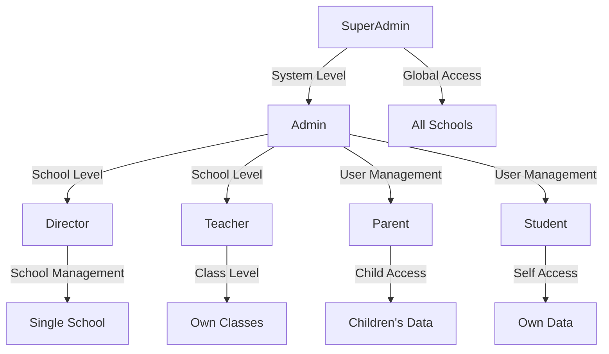

# System Role Definitions

This document defines all user roles in the School Management System, including their responsibilities, access boundaries, and scope limitations. These definitions serve as the foundation for the permission matrix and RBAC (Role-Based Access Control) implementation.

## Role Overview



---

## Role Hierarchy

1. **System Level**: SuperAdmin
2. **School Level**: Admin, Director
3. **Operational Level**: Teacher
4. **User Level**: Parent, Student

---

## 1. SuperAdmin

### Description
System-level administrator with full access across all schools and system configuration.

### Responsibilities
- Create and manage schools in the system
- Create and manage system-level Admin users
- Configure system-wide settings
- Oversee all schools and their data
- Manage system users and roles
- Access all audit logs and system reports

### Access Scope
- **Scope Level**: **Global** (System-wide)
- **School Access**: All schools
- **User Management**: Can create/manage Admins and other system-level users
- **Data Access**: Full access to all data across all schools

### Limitations
- None - full system access

### Technical Implementation
- Keycloak Role: `SUPER_ADMIN`
- Permissions: All permissions (composite role with all client roles)
- Multi-tenancy: Access to all school contexts

---

## 2. Admin

### Description
School-level administrator responsible for managing users, roles, and school configuration within a specific school.

### Responsibilities
- Create and manage users within assigned school
- Assign roles and permissions to users at school level
- Manage school configuration and settings
- Oversee school operations and data
- Manage academic year, terms, and school calendar
- Assign teachers to classes
- Configure school-specific policies

### Access Scope
- **Scope Level**: **School-based**
- **School Access**: Single school (assigned)
- **User Management**: Can create/manage Directors, Teachers, Parents, and Students within their school
- **Data Access**: Full access to all data within assigned school

### Limitations
- Cannot access other schools' data
- Cannot create or manage system-level users (SuperAdmin, Admin)
- Cannot create new schools
- Limited to assigned school context

### Technical Implementation
- Keycloak Role: `ADMINISTRATOR`
- Permissions: School-level permissions (composite role excluding MANAGE_ADMINISTRATORS)
- Multi-tenancy: Access restricted to assigned school ID

---

## 3. Director

### Description
School-level director with full visibility of school dashboard and academic data within a specific school.

### Responsibilities
- View comprehensive school dashboard and analytics
- View and analyze all academic data within the school
- Generate school-wide reports
- Monitor student performance and attendance
- Review teacher performance metrics
- Access financial and administrative reports

### Access Scope
- **Scope Level**: **School-based** (Read-Only)
- **School Access**: Single school (assigned)
- **User Management**: View-only access to users
- **Data Access**: Read access to all data within assigned school

### Limitations
- Cannot modify user data or roles
- Cannot manage teachers or classes
- Cannot modify academic records
- Read-only access (no write permissions)
- Limited to assigned school context

### Technical Implementation
- Keycloak Role: `DIRECTOR`
- Permissions: View permissions only (no management permissions)
- Multi-tenancy: Access restricted to assigned school ID

---

## 4. Teacher

### Description
Operational-level user responsible for managing their own classes, attendance, and grading.

### Responsibilities
- Manage attendance for assigned classes
- Record and modify grades for students in assigned classes
- Manage exam results and assessments
- Submit reports to school administration
- View student information for assigned classes
- Manage class schedules and assignments

### Access Scope
- **Scope Level**: **Class-based**
- **School Access**: Single school (employed at)
- **Class Access**: Only assigned classes
- **Student Access**: Only students in assigned classes
- **Data Access**: Full CRUD access within assigned classes

### Limitations
- Cannot access other teachers' classes
- Cannot view students not in assigned classes
- Cannot modify school configuration
- Cannot create or manage users
- Limited to assigned classes within school context

### Technical Implementation
- Keycloak Role: `TEACHER`
- Permissions: `MANAGE_ATTENDANCE`, `MANAGE_GRADES`
- Special Permissions (based on assignment):
  - `COLLECT_ATTENDANCE` (for class leaders)
  - `COLLECT_EXAM_RESULTS` (for class teachers grades 7-12)
  - `SUBMIT_REPORTS`
  - `MANAGE_HOMEROOM` (for homeroom teachers grades 1-6)
- Multi-tenancy: Access restricted to assigned school ID
- Row-level security: Filtered by teacher ID and class assignments

---

## 5. Parent

### Description
Guardian user with access to their children's academic information, attendance, and grades.

### Responsibilities
- View children's class schedules
- View children's attendance records
- View children's grades and academic progress
- Receive notifications about children's activities
- Communicate with teachers (if messaging is implemented)
- View children's exam results and reports

### Access Scope
- **Scope Level**: **Child-based**
- **School Access**: Schools where children are enrolled (can be multiple)
- **Student Access**: Only linked children
- **Data Access**: Read-only access to children's data

### Limitations
- Cannot modify any academic data
- Cannot access other students' information
- Cannot access administrative features
- Read-only access only
- Limited to linked children's data

### Technical Implementation
- Keycloak Role: `PARENT`
- Permissions: View-only permissions for linked children
- Multi-tenancy: Access restricted to schools where children are enrolled
- Row-level security: Filtered by parent-child relationships

---

## 6. Student

### Description
End-user with access to their own academic information, schedules, and grades.

### Responsibilities
- View own class schedules
- View own attendance records
- View own grades and academic progress
- Access learning materials and assignments
- View exam results
- Update own profile (limited fields)

### Access Scope
- **Scope Level**: **Self-based**
- **School Access**: School where enrolled
- **Class Access**: Only enrolled classes
- **Data Access**: Read-only access to own data

### Limitations
- Cannot view other students' information
- Cannot modify grades or attendance
- Cannot access administrative features
- Read-only access (except own profile)
- Limited to own data only

### Technical Implementation
- Keycloak Role: `STUDENT`
- Permissions: View-only permissions for self
- Multi-tenancy: Access restricted to enrolled school ID
- Row-level security: Filtered by student ID (self)

---

## Scope Limitations Summary

| Role | Scope Level | School Access | User Management | Data Modification |
|------|-------------|---------------|-----------------|-------------------|
| **SuperAdmin** | Global | All schools | All users | Full (all schools) |
| **Admin** | School-based | Single school | School users | Full (within school) |
| **Director** | School-based | Single school | View only | None (read-only) |
| **Teacher** | Class-based | Single school | None | Full (assigned classes) |
| **Parent** | Child-based | Multiple schools | None | None (read-only) |
| **Student** | Self-based | Single school | None | None (read-only) |

---

## Access Boundary Matrix

### System-Level vs School-Level Access

| Feature | SuperAdmin | Admin | Director | Teacher | Parent | Student |
|---------|------------|-------|----------|---------|--------|---------|
| **Create Schools** | ✓ | ✗ | ✗ | ✗ | ✗ | ✗ |
| **Manage System Admins** | ✓ | ✗ | ✗ | ✗ | ✗ | ✗ |
| **Access All Schools** | ✓ | ✗ | ✗ | ✗ | ✗ | ✗ |
| **Manage School Users** | ✓ | ✓ | ✗ | ✗ | ✗ | ✗ |
| **View School Dashboard** | ✓ | ✓ | ✓ | ✗ | ✗ | ✗ |
| **Manage Classes** | ✓ | ✓ | ✗ | ✗ | ✗ | ✗ |
| **Manage Attendance** | ✓ | ✓ | ✗ | ✓* | ✗ | ✗ |
| **Manage Grades** | ✓ | ✓ | ✗ | ✓* | ✗ | ✗ |
| **View Own Children** | ✗ | ✗ | ✗ | ✗ | ✓ | ✗ |
| **View Own Data** | ✓ | ✓ | ✓ | ✓ | ✓ | ✓ |

*\* Limited to assigned classes only*

---

## Multi-School Architecture Alignment

### School Context Resolution

Each role's access is filtered by school context:

1. **SuperAdmin**: No school filter - global access
2. **Admin**: Filtered by `schoolId` in user assignment
3. **Director**: Filtered by `schoolId` in user assignment
4. **Teacher**: Filtered by `schoolId` in employment record
5. **Parent**: Filtered by children's `schoolId` (can access multiple schools)
6. **Student**: Filtered by enrollment `schoolId`

### Multi-Tenancy Implementation

- **Database Level**: All tables include `school_id` column for multi-tenancy
- **Application Level**: Spring Security filters queries by school context
- **API Level**: Requests include school context header or derive from user token
- **Cache Level**: Cache keys include school context

---

## Permission Mapping (Keycloak Composite Roles)

### SuperAdmin Permissions
Composite role includes all client roles:
- COLLECT_ATTENDANCE
- MANAGE_ATTENDANCE
- COLLECT_EXAM_RESULTS
- SUBMIT_REPORTS
- VIEW_ALL_STUDENTS
- MANAGE_GRADES
- MANAGE_HOMEROOM
- MANAGE_ADMINISTRATORS

### Administrator Permissions
Composite role includes:
- COLLECT_ATTENDANCE
- MANAGE_ATTENDANCE
- COLLECT_EXAM_RESULTS
- SUBMIT_REPORTS
- VIEW_ALL_STUDENTS
- MANAGE_GRADES
- MANAGE_HOMEROOM

### Teacher Permissions
Composite role includes:
- MANAGE_ATTENDANCE
- MANAGE_GRADES

### Director Permissions
- VIEW_SCHOOL_DASHBOARD
- VIEW_ACADEMIC_DATA
- VIEW_REPORTS
- VIEW_STUDENTS
- VIEW_TEACHERS

### Parent Permissions
- VIEW_CHILDREN_DATA
- VIEW_CHILDREN_ATTENDANCE
- VIEW_CHILDREN_GRADES
- VIEW_CHILDREN_CLASSES

### Student Permissions
- VIEW_OWN_DATA
- VIEW_OWN_ATTENDANCE
- VIEW_OWN_GRADES
- VIEW_OWN_CLASSES

---

## Role Assignment Rules

### Assignment Authority

| Assigner Role | Can Assign Roles |
|---------------|------------------|
| **SuperAdmin** | All roles |
| **Admin** | Director, Teacher, Parent, Student (within school) |
| **Director** | None |
| **Teacher** | None |
| **Parent** | None |
| **Student** | None |

### Assignment Constraints

1. **SuperAdmin** can only be assigned by another SuperAdmin
2. **Admin** can only be assigned by SuperAdmin
3. **Director** can be assigned by Admin (within same school)
4. **Teacher** can be assigned by Admin (within same school)
5. **Parent** can be created by Admin (within same school)
6. **Student** can be created by Admin (within same school)

### Multi-Role Support

Users can have multiple roles:
- Example: A user can be both a Teacher and a Parent
- Role permissions are cumulative
- Most restrictive scope applies per role
- Users must specify active role/context when accessing system

---

## Data Access Patterns

### SuperAdmin
```sql
-- No filters - global access
SELECT * FROM students;
SELECT * FROM schools;
```

### Admin
```sql
-- Filtered by assigned school
SELECT * FROM students WHERE school_id = :adminSchoolId;
SELECT * FROM teachers WHERE school_id = :adminSchoolId;
```

### Director
```sql
-- Filtered by assigned school (read-only)
SELECT * FROM students WHERE school_id = :directorSchoolId;
SELECT * FROM academic_records WHERE school_id = :directorSchoolId;
```

### Teacher
```sql
-- Filtered by assigned classes
SELECT * FROM students s
JOIN class_students cs ON s.id = cs.student_id
JOIN classes c ON cs.class_id = c.id
JOIN teacher_assignments ta ON c.id = ta.class_id
WHERE ta.teacher_id = :teacherId;
```

### Parent
```sql
-- Filtered by parent-child relationships
SELECT * FROM students s
JOIN parent_children pc ON s.id = pc.child_id
WHERE pc.parent_id = :parentId;
```

### Student
```sql
-- Filtered by student ID (self)
SELECT * FROM students WHERE id = :studentId;
SELECT * FROM attendance WHERE student_id = :studentId;
```

---

## Next Steps

1. **Permission Matrix Design**: Define granular permissions for each role
2. **RBAC Implementation**: Implement role-based access control in Spring Security
3. **Multi-Tenancy Filters**: Implement school context filters in database queries
4. **Row-Level Security**: Implement filters based on user assignments
5. **API Authorization**: Implement `@PreAuthorize` annotations on controllers
6. **Audit Logging**: Log role-based actions for compliance

---

## Approval Checklist

- [ ] Role definitions reviewed and approved
- [ ] Scope boundaries validated
- [ ] Multi-school architecture alignment confirmed
- [ ] Ready for permission matrix design
- [ ] Ready for RBAC implementation

---

## Notes

- All role names use SCREAMING_SNAKE_CASE in Keycloak (e.g., `SUPER_ADMIN`)
- PascalCase used in documentation for readability (e.g., `SuperAdmin`)
- Roles are implemented as Keycloak realm roles
- Permissions are implemented as Keycloak client roles
- Composite roles map realm roles to client role permissions
- Director role is a new addition to the system (not yet in Keycloak initializer)
